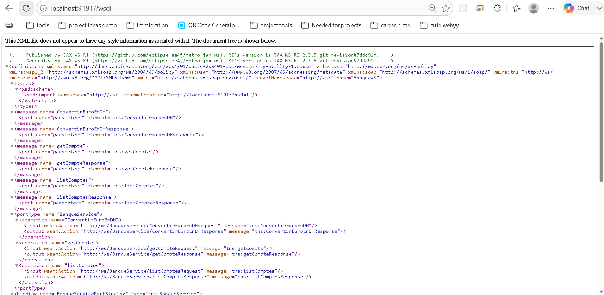
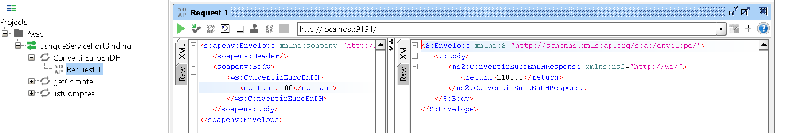
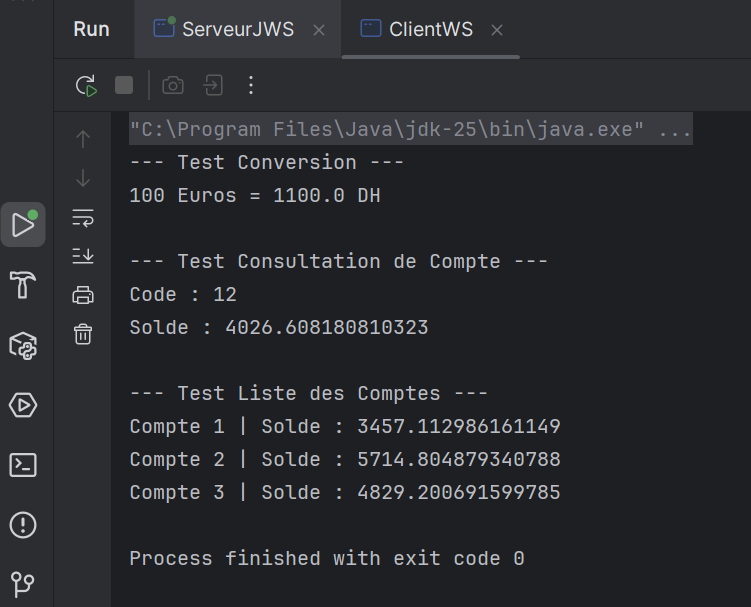

# Java SOAP Web Service (JAX-WS) - TP3

This project is a complete implementation of a SOAP Web Service using Java, JAX-WS (Jakarta XML Web Services), and Maven. It demonstrates how to create a SOAP server, publish a WSDL, and consume the service using an automatically generated Java client.

## Features

The Web Service provides the following operations:
* `ConvertirEuroEnDH`: Converts an amount from Euros to Moroccan Dirhams (DH).
* `getCompte`: Fetches the details of a specific bank account using its code.
* `listComptes`: Retrieves a list of available bank accounts.

## Technologies Used

* **Java** (JDK 11 / 17 / 25)
* **JAX-WS** (Jakarta EE)
* **Maven** (Dependency management & Stub generation)
* **IntelliJ IDEA** (or Eclipse)
* **SoapUI** / **Oxygen** (For WSDL analysis and testing)

## Screenshots

### 1. WSDL in Web Browser
> *This screenshot shows the WSDL file generated by the JAX-WS server.*


### 2. Testing with SoapUI
> *This screenshot demonstrates testing the `ConvertirEuroEnDH` operation using SoapUI.*


### 3. Java Client Console Output
> *This screenshot shows the final result of the `ClientWS` executing and interacting with the server.*


---

## How to Run the Project

### 1. Start the Server
First, you need to publish the Web Service.
* Navigate to `src/main/java/server/ServeurJWS.java`
* Run the `main` method.
* The server will start and output: `Web service déployé et en écoute sur : http://0.0.0.0:9191/`

### 2. Verify the WSDL
Once the server is running, open your web browser and navigate to:
```text
http://localhost:9191/?wsdl

